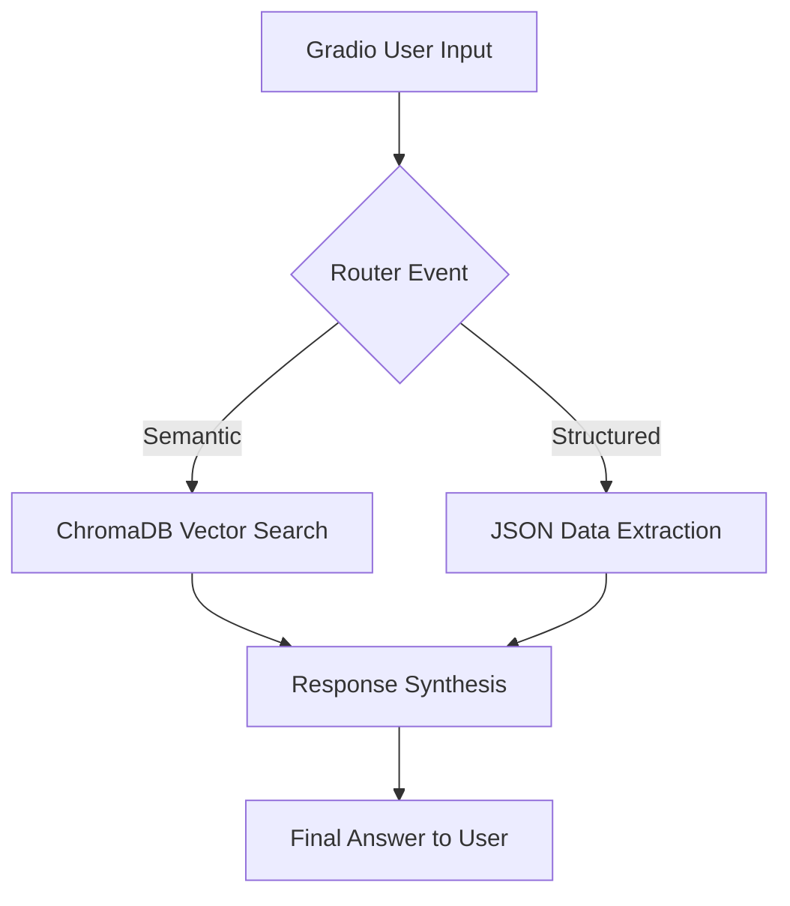

# מערכת RAG חכמה עם LlamaIndex

מערכת Retrieval-Augmented Generation מתקדמת עם ניתוב דינמי בין חיפוש סמנטי למובנה.

## מטרת הפרויקט

מערכת זו מאפשרת שאילתות חכמות על תיעוד טכני באמצעות:
- **ניתוב אוטומטי**: המערכת מזהה אם השאלה דורשת חיפוש סמנטי (הבנה עמוקה) או חיפוש מובנה (נתונים מדויקים)
- **חיפוש וקטורי**: שימוש ב-ChromaDB לחיפוש סמנטי מתקדם
- **נתונים מובנים**: גישה ישירה ל-JSON עבור שאלות שדורשות רשימות, תאריכים והשוואות
- **תמיכה בעברית**: אופטימיזציה מלאה לשפה העברית עם Cohere Multilingual

## ארכיטקטורה

### תרשים זרימה (Workflow)



### רכיבי המערכת

1. **Gradio UI** - ממשק משתמש עם תמיכה מלאה ב-RTL לעברית
2. **Router** - מסווג שאלות לסמנטי/מובנה באמצעות מילות מפתח
3. **Retrieval Layer**:
   - **Semantic**: חיפוש וקטורי ב-ChromaDB
   - **Structured**: שליפה מ-JSON מחולץ
4. **Synthesis** - יצירת תשובה קוהרנטית בעברית עם Cohere

## טכנולוגיות

- **Embeddings**: Cohere `embed-multilingual-v3.0` (dimension: 1024)
- **LLM**: Cohere `command-r-08-2024`
- **Vector DB**: ChromaDB (local, persistent)
- **Framework**: LlamaIndex Workflows
- **UI**: Gradio

## איך להריץ?

### שלב 1: התקנת חבילות

```bash
pip install -r requirements.txt
```

### שלב 2: הגדרת מפתח API

1. קבלי מפתח Cohere מ: https://dashboard.cohere.com/api-keys
2. פתחי את הקובץ `.env` והדביקי את המפתח:

```
COHERE_API_KEY=your_cohere_api_key_here
```

### שלב 3: הרצת המערכת

```bash
python app.py
```

הדפדפן ייפתח אוטומטית ב-`http://localhost:7860`

## שאלות לדוגמה

### סמנטי (Semantic) - שאלות "איך" ו"למה"
- "למה בחרנו ב-PostgreSQL על פני MongoDB?"
- "מה היתרונות של Prisma כ-ORM?"
- "איך המערכת מטפלת בעיבוד מסמכים?"
- "הסבר על החלטת השימוש ב-Tailwind CSS"

### מובנה (Structured) - רשימות, תאריכים, השוואות
- "תן לי רשימה של כל ההחלטות הטכניות"
- "אילו החלטות טכניות התקבלו בתאריך 15/01?"
- "מה השתנה בשבוע האחרון?"
- "תן לי רשימה של כל המשימות הפתוחות"
- "מהם כל הכללים של UI במערכת?"

### משולב
- "תן לי רשימה של כל הכללים שקשורים ל-UI במערכת"
- "השווה בין ההחלטות שהתקבלו ב-14/01 לבין אלו מ-17/01"

## מבנה הפרויקט

```
.
├── .cursor/notes/          # תיעוד טכני
│   ├── spec.md            # מפרט טכני
│   ├── decisions.md       # החלטות טכניות
│   └── tasks.md           # משימות
├── .claude/                # כללי עבודה
│   └── rules.md           # כללי UI
├── chroma_db/              # מסד נתונים וקטורי מקומי
├── workflow.py             # Event-driven workflow
├── config.py               # Cohere + ChromaDB setup
├── app.py                  # Gradio interface
├── structured_data.json    # נתונים מובנים מחולצים
└── README.md               # תיעוד זה
```

## רפלקציה

### מגבלות נוכחיות
- **הצלבת נתונים**: המערכת מתקשה בשאלות שדורשות הצלבה בין שני קבצי JSON שונים בו-זמנית
- **שאלות מורכבות**: שאלות עם מספר תת-שאלות עלולות להתנתב באופן לא מדויק
- **זיכרון שיחה**: אין תמיכה בהקשר היסטורי של השיחה
- **ניתוב מבוסס כללים**: הניתוב נעשה על בסיס מילות מפתח ולא באמצעות LLM (בגלל מגבלות API)

### תובנות מרכזיות
- **Cohere Multilingual**: המעבר ל-`embed-multilingual-v3.0` שיפר דרמטית את יכולת החיפוש בשאלות בעברית לעומת מודלים אחרים. דיוק החיפוש עלה משמעותית
- **Event-Driven Architecture**: שימוש ב-Workflows של LlamaIndex הפך את הקוד למודולרי ונוח לתחזוקה
- **Hybrid Retrieval**: שילוב חיפוש וקטורי עם נתונים מובנים מאפשר מענה רחב יותר לסוגי שאלות
- **ChromaDB Local**: שימוש ב-ChromaDB מקומי פתר בעיות חסימה של NetFree ואפשר עבודה אופליין

### שיפורים עתידיים
1. הוספת memory buffer לשיחות רב-תורניות
2. שימוש ב-LLM לניתוב במקום כללים (כאשר יהיה זמין)
3. תמיכה בשאלות היברידיות שדורשות שני סוגי חיפוש
4. הוספת re-ranking למיון תוצאות חיפוש

## דרישות מערכת

- Python 3.8+
- מפתח API של Cohere (חינמי)
- 2GB שטח דיסק (למסד הנתונים הוקטורי)

---
**נבנה עם ❤️ באמצעות LlamaIndex, Cohere ו-ChromaDB**
